# Serverless Multi-region API Example

AWS Lambda + API Gatewayでつくるのサーバーレスアーキテクチャのマルチリージョン構成のサンプル

# Requirements

- Node.js
- NPM
- Python

# Directory

```
.
├── README.md
├── doc/
├── tools/  <--- 運用スクリプト
├── resources/  <--- AWSリソースのコード
├── api/  <--- APIのコード
├── deploy_api.sh  <--- APIのデプロイスクリプト
├── deploy_resources.sh  <--- AWSリソースのデプロイスクリプト
└── settings.conf  <--- プロジェクト設定
```


# Installation

```bash
cd api/
npm install
pip install -r requirements.txt
```

# Architecture



- Route53でフェールオーバールーティング
- APIはBlue-Greenデプロイを採用する。
- DynamoDBはGlobal Tableにする。


# Deployment
## デプロイ先
- リソースは全てAWSアカウント上にデプロイされる。
  - プライマリ・セカンダリとして2つのリージョンに展開がされる。
  - リージョンは `setting.conf` の `PRIMARY_REGION` , `SECONDARY_REGION` で定義する。
- ステージごとに別々のAWSアカウントに分けてデプロイも可能


## 事前準備
AWSコンソールやCLIで以下をステージごとに作成する。

- Route53でホストゾーン作成
  - ドメインを用意する
- ACMで上記ドメインに対応するSSL証明書を発行


## 初回デプロイ (新規作成)
**※ 各ステージの初回デプロイ時に実行する**


### TerraformのBackend用S3バケットとDynamoDBテーブルの作成

```bash
sh tools/create_tf_state_storage_and_locking.sh {stage} {aws_profile}
```

### パラメータ設定

必要なパラメータを設定する

```bash
sh tools/put_parameters.sh {stage} {aws_profile}
```

### Terraformの設定ファイルを生成

以下スクリプトを実行。

```bash
sh tools/generate_stage_tf_files.sh {stage} {aws_profile}
```


`resource/terraform.{stage}.tfbackend` と `resource/terraform.{stage}.tfvars` が生成される。


### S3バケットとDynamoDBテーブルのデプロイ

APIのデプロイ前に、S3バケットとDynamoDBをデプロイする。

以下スクリプトを実行。

```bash
sh deploy_resources.sh apply init {stage} {aws_profile}
```

この際にデプロイするリソース (TerraformのTargets) については `settings.conf` の `TF_INITIAL_TARGETS` で定義する。

### APIの初回デプロイ

以下スクリプトをAPIを環境それぞれをデプロイする。

```bash
sh deploy_api.sh deploy {stage} {aws_profile} envA
sh deploy_api.sh deploy {stage} {aws_profile} envB
```

### その他リソースをデプロイ
以下スクリプトを実行。

```bash
sh deploy_resources.sh apply all {stage} {aws_profile}
```

## APIのデプロイ (アップデート)
**※ コードの変更を反映する際に実行する**

Blue-Greenデプロイを採用する。

### APIのデプロイ
以下スクリプトを実行。

```bash
sh deploy_api.sh deploy {stage} {aws_profile}
```

ターゲットとなっていない環境へデプロイされる

コマンドの後ろに環境を記載することでデプロイする環境を指定することができる。

```bash
sh deploy_api.sh deploy {stage} {aws_profile} {api_env}
```

### ターゲット切り替え
以下スクリプトを実行。

```bash
sh deploy_resources.sh apply all {stage} {aws_profile}
```

例えば、環境が「envA」「envB」の2つある時、現在「envA」がターゲットになっている場合は「envB」への切り替えが行われる。

**ターゲットの環境はプライマリとセカンダリで共通しておく。不一致な場合はプライマリを正とする。**

各リージョンのAPI GatewayのAPIマッピングとRoute53ヘルスチェックに変更がかかる。

環境については指定も可能。以下を参照。

## API以外のAWSリソースをデプロイ (アップデート)
**※ API以外のインフラリソースの変更を反映する際に実行する**

以下スクリプトを実行。

```bash
sh deploy_resources.sh apply all {stage} {aws_profile} {api_env}
```

**{api_env}を指定しない場合、APIのターゲット環境が切り替わってしまうため、現在ターゲットとなっている環境を指定してデプロイする。**

**注意: API以外のリソースについては、Blue-GreenデプロイではなくIn-Placeデプロイとなる。あらかじめ以下でPlanを実行し、変更点を確認する。**

```bash
sh deploy_resources.sh plan all {stage} {aws_profile} {api_env}
```

現在ターゲットとなっている環境の情報は以下のスクリプトを実行して取得する。

```bash
sh tools/get_api_stages.sh {stage} {aws_profile}
```

## ロールバック
### API
- ターゲットを旧環境へ切り戻す
	- 向先を変えるだけ。

### API以外のAWSリソース
- コードのバージョンを前リリースのコミットに戻して、再デプロイ

# Notes

## リソース構成管理
### 管理ツール
- APIの根幹となるAWS Lambda + API Gatewayについては [Serverless Framework](https://www.serverless.com/framework/docs/providers/aws/) で管理する
  - `api/` ディレクトリに格納
  - API Gatewayの一部リソース (APIキーやカスタムドメイン設定など) については、後述のTerraformで管理する。
- その他のAWSリソースは [Terraform](https://registry.terraform.io/providers/hashicorp/aws/latest/docs) で管理する。
  - `resources/` ディレクトリに格納
  - ただし、以下については対象には含まれない。
    - ドメインやSSL証明書など手動などで別途作成するもの
    - TerraformのRemote StateのためのS3バケット, DynamoDBテーブル
    - パラメータ保管のためのSSM Parameter Store

### 2つのAPI環境の管理について
- Blue-Greenデプロイをするために、各リージョンにAPI環境を2つ用意し、更新毎にそれぞれを切り替える形とする。
- 2つの環境は、API GatewayのステージとLambdaの修飾エイリアスで分離させる。
- 設定とデプロイはServerless Frameworkのプラグインである [serverless-aws-alias](https://www.npmjs.com/package/serverless-aws-alias) を利用する。


### リソース名の共有

- Terraformで作成したリソースのうち、Lambdaと連携するものについては、そのリソース名をTerraformのOutputで出力し、Serverless Frameworkによるデプロイ時に受け渡す。
  - `serverless.yml` 内での変数名 (opt) とoutputのキーは同じにする。
- また、Serverless Frameworkで作成したAPI GatewayのIDは、Serverless FrameworkのInfoコマンドにて出力し、Terraformによるデプロイ時に受け渡す。

### Terraformの構成
#### ステージの分離
workspace機能で分ける。

Memo

*環境間の差異を考慮する場合、環境ごとにディレクトリを分けて各環境ごとに .tf ファイルを作成する方法が挙げられるが、デプロイするリソースにはステージ間で差異のないようにする方針をとり、DRY原則に従うことを優先して、Workspaceを使う方法をとる。  
リソース名といった環境間の差異のある部分については、変数 (tfvars) で制御する。*

参考: 
https://www.terraform-best-practices.com/
https://qiita.com/m22r/items/7d80d149e3fb3494c1d4
https://qiita.com/TsuyoshiUshio@github/items/dcb7b950653f471616aa

#### 各リソースの定義
各リソースはグローバル単位とリージョン単位で `global/` と `regional/ ` に分ける。

現在は作成されるリソースはリージョン間で差異はないが、片側のみに作成するものが発生する場合は、各リージョンごとにモジュール記述用のディレクトリおよびtfファイルを `regiona/` 配下に作成し、トップディレクトリから別途モジュールとして読み出すことを想定する。

```
regional/
	resources/
	primary/
		main.tf
	secondary/
		main,tf
	main.tf
```

#### パラメータ
- tfvarsファイルとコマンドライン引数 (-var) で指定する
- ステージごとの各パラメータはSSMパラメータストアに格納 (後述の「デプロイパラメータの保管」参照)
- テンプレートを用意し、各ステージごとに生成する (前述の「Deployment>初回デプロイ (新規作成)>Terraformの設定ファイルを生成」を参照)
- 以下のパラメータは、SSMパラメータストアには格納せず、デプロイ時に自動で指定する。
  - API GatewayのID (各リージョン)
  - ターゲットとする環境


## 設定ファイル

- `settings.conf` に各種設定を記載する。
- プロジェクト設定やステージ依存しない設定値を管理する。
- 秘匿情報や外部パラメータ、ステージ依存するような設定値は、後述の「デプロイパラメータの保管」を参照

## デプロイパラメータの保管

パラメータはSSM Parameter Storeに格納する。
SSM Parameter Storeのリージョンはプライマリリージョンとする

- 命名規則: `/アプリ名(固定)/ステージ名/パラメータ名`
- 例: 
  - アプリ名="api-multiregion-example"
  - ステージ名="dev"
  - パラメータ名="domain\_name"
  - /api-multiregion-example/dev/domain_name
 
必要なパラメータは `settings.conf` で `PARAMETERS` として定義する。
 
**パラメータの格納**

```bash
sh tools/put_parameters.sh {stage} {aws_profile}
```

**格納されている全てのパラメータの参照**

```bash
sh tools/get_parameters.sh {stage} {aws_profile}
```

**格納されているパラメータの個別参照 (フルパスを指定)**

```bash
sh tools/get_parameter.sh {parameter_name} {stage} {aws_profile}
```